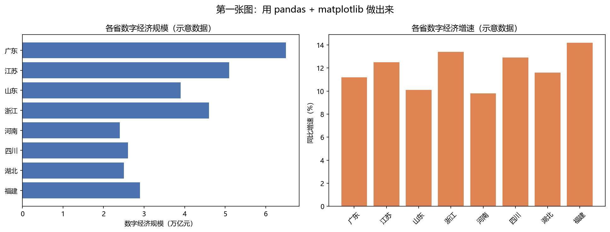

# ai-dev-learning

数字经济研究生的 AI 开发学习记录。目标：12 周内做出可展示的项目作品集。

**仓库地址**：https://github.com/yingyingchen866/ai-dev-learning

## 项目

| 目录 | 内容 | 状态 |
|---|---|---|
| [week1-env](week1-env/) | 环境搭建：Python、Git、编辑器、第一个脚本 | ✅ 完成 |
| [week2-realdata](week2-realdata/) | 分省数字经济数据分析（国家统计局 2759 条官方数据） | ✅ 完成 |

## 当前进度

- [x] **第 1 周**：环境搭建 —— Python、Git、编辑器、第一个可运行脚本，代码已推送 GitHub
- [x] **第 2 周**：真实数据 —— 打通国家统计局新版接口，抓取 31 省 10 年数据并完成分析
- [ ] 第 3 周：整理成可复现的项目（README + 提交历史）
- [ ] 第 4–6 周：调用大模型 API，做出一个 AI 小工具
- [ ] 第 7–10 周：完整的带界面小产品
- [ ] 第 11–12 周：作品集包装与面试讲述

## 环境

| 组件 | 版本 / 位置 |
|---|---|
| Python | 3.12.4（`D:\xinpython`） |
| Git | 2.55 |
| 编辑器 | Cursor 3.19.7 |
| 主要库 | pandas 2.2.2、numpy 1.26.4、matplotlib 3.8.4、streamlit 1.32.0、openai 3.26.0、openpyxl 3.1.2 |

环境自检结果：**8 / 8 就绪**，5 项关键功能探测全部通过。

## 第一张图



（图中为**示意数据**，仅用于验证代码，不是真实统计结果。）

## 目录结构

```
ai-dev-learning/
├── README.md              # 你正在看的文件
├── .gitignore             # 哪些文件不提交（关键是 .env）
├── week1-env/             # 第 1 周：环境搭建
│   ├── check_env.py       # 环境自检：库 + 关键功能探测
│   ├── hello.py           # 第一个脚本：验证工具链
│   ├── first_chart.py     # 第一次数据分析 + 画图
│   └── output/            # 生成的图表
└── week2-realdata/        # 第 2 周：真实数据项目
    ├── README.md          # 项目说明 + 数据源探索全过程
    ├── fetch_nbs_data.py  # 从国家统计局接口取数
    ├── analyze_digital_economy.py  # 分析 + 画图 + 异常检查
    ├── data/raw/          # 2759 条官方数据 + 数据说明
    ├── output/            # 4 张分析图表
    └── probes/            # 数据源探索过程的脚本与原始返回
```

## 怎么运行

```bash
# 第 1 周：环境检查与入门脚本
python week1-env/check_env.py
python week1-env/hello.py
python week1-env/first_chart.py

# 第 2 周：真实数据（取数约需 3-5 分钟）
cd week2-realdata
python fetch_nbs_data.py
python analyze_digital_economy.py
```

## 关于数据

| 项目 | 数据类型 | 说明 |
|---|---|---|
| week1-env | **示意数据** | 只用于练习代码，不可引用 |
| week2-realdata | **官方真实数据** | 国家统计局分省年度数据，可追溯、可复现 |

真实分析必须使用可追溯的公开数据源，并在项目 README 中写明
数据来源、获取日期和抓取脚本——这既是学术诚信要求，
也是作品集能否被别人信任的关键。详见 [week2-realdata/README.md](week2-realdata/README.md)。

## 学习日志

| 日期 | 做了什么 | 卡在哪里 | 怎么解决的 |
|---|---|---|---|
| 2026-10-07 | 确认 Python 3.12.4 / Git 2.55 已就绪；安装 Cursor 与 openai；跑通 `hello.py` 与 `first_chart.py`；建立 Git 仓库并完成首次提交 | 命令连续两次无法启动，报"临时目录不存在" | 没有去猜代码问题，而是读报错本身：运行环境依赖的临时目录中途消失，重建后恢复。**教训：报错文本往往直接写明原因。** |
| 2026-10-07 | 注册 GitHub，把本地仓库推送上去 | 推送报 `Repository not found`，可仓库明明已经建好 | 没有怀疑网络或权限，而是直接去查仓库列表：仓库名多了一个前导短横线（`-ai-dev-learning`）。改名后推送成功。**教训：报错说"找不到"时，先逐字比对名字——这类错误占了新手调试时间的一大半。** |
| 2026-10-07 | 第 2 周：抓取国家统计局分省数据并完成分析，得到 2759 条官方记录 | 数据源连撞三堵墙：① 旧接口被 WAF 拦截（403 UrlACL）；② 年鉴在线版表格全是 JPG 图片，无法机读；③ 省份代码格式未知 | ① 放弃绕过风控，改找替代路径；② 用探查脚本测遍所有扩展名，确认只有图片，果断放弃 OCR；③ 搜到 2026 新版接口，用「目录树 → 指标 → 数据」三步走打通；省份代码经矩阵测试确认必须 12 位、且一次一个地区。**教训：数据获取占实证研究一半以上的时间，而"测出来"永远比"猜"可靠。** |
| 2026-10-07 | 分析脚本加入异常值自动检查 | 发现 8 处同比下滑超 30% 的记录（青海 -69.9% 最极端） | **尚未解释**，已写入 README 的"已知问题"。三种可能：统计口径调整 / 真实冲击 / 数据错误。在查明前不能写成"某省数字经济负增长"。**教训：官方数据也会异常，不做检查直接解读会得出错误结论。** |
