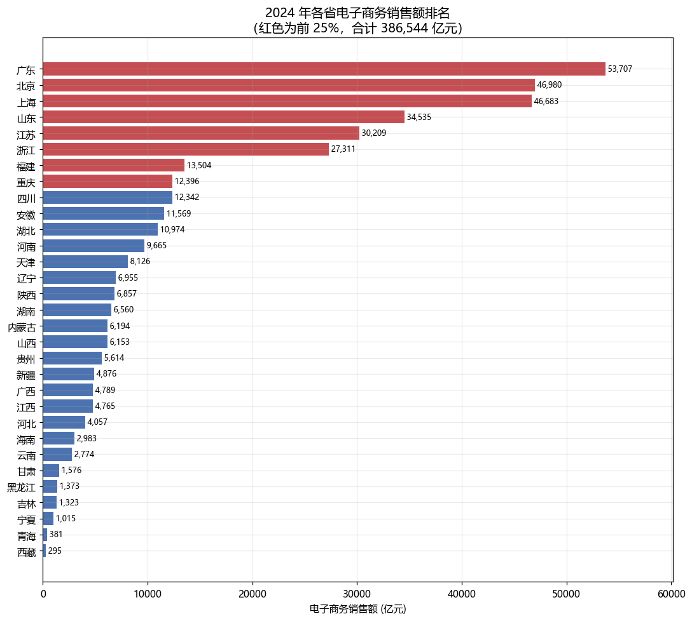
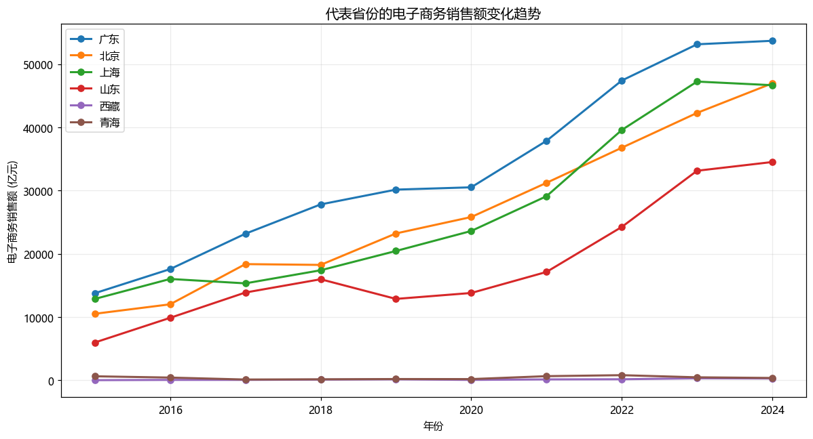

# 分省数字经济数据分析

用国家统计局官方数据，分析 2015–2024 年中国 31 个省级行政区的电子商务发展状况。

**数据规模**：31 省 × 10 年 × 9 个指标 = 2759 条官方记录
**可复现性**：跑两个脚本即可从官方接口重新取数并复现全部结论

---

## 核心发现（2024 年）

| 指标 | 结果 |
|---|---|
| 31 省电子商务销售额合计 | **386,544 亿元** |
| 第一名 | **广东 53,707 亿元**（占全国 13.9%） |
| 前 5 名 | 广东、北京、上海、山东、江苏 |
| 前 5 省集中度 | **54.9%** |
| 最大 / 最小 | 广东 53,707 / 西藏 295，**相差 181.8 倍** |
| 2015→2024 增长最快 | 西藏 9.41 倍、山西 9.09 倍、宁夏 9.09 倍 |





---

## 数据源是怎么找到的（这部分才是重点）

做实证研究，**"数据从哪来"往往比"怎么跑回归"更花时间**。完整记录如下。

### 第一步：直接调旧接口 → 被 WAF 拦截

国家统计局「国家数据」平台的传统接口是：

```
https://data.stats.gov.cn/easyquery.htm?m=QueryData&dbcode=fsnd&...
```

结果：

```
403 Forbidden
eventID: 1249-...-w-waf04zzst  reason:UrlACL
```

补全 `Referer`、`X-Requested-With`、`Accept-Language` 等浏览器请求头后依然 403。
**结论：这条路不通，且不应尝试绕过政府网站的风控。**

### 第二步：改用《中国统计年鉴》在线版 → 表格是图片

年鉴在线版的目录页 `left.htm` 可以正常访问，里面能找到目标表格：

| 表号 | 表名 |
|---|---|
| 16-37 | 互联网主要指标发展情况 |
| 16-38 | 软件和信息技术服务业主要经济指标 |
| 16-40 | 分地区企业信息化及电子商务情况 |

但测试所有扩展名后发现：

```
html/C16-40.htm    404
html/C16-40.xls    404
html/C16-40.xlsx   404
html/C16-40.jpg    200   ← 只有图片
```

**结论：`pandas.read_html` 用不了，OCR 识别统计表对新手项目过于脆弱。**
（探查过程保留在 `probes/probe_table_formats.py`）

### 第三步：找到 2026 年新版接口

国家统计局已经上线了新接口，路径完全不同，**不在旧 WAF 规则的拦截范围内**：

```
https://data.stats.gov.cn/dg/website/publicrelease/web/external
```

新版接口采用「三步走」设计，用 UUID 标识数据集：

| 步骤 | 接口 | 作用 |
|---|---|---|
| 1 | `/new/queryIndexTreeAsync` | 遍历目录树，找到数据集 `cid` |
| 2 | `/new/queryIndicatorsByCid` | 拿到指标 `indicatorId` |
| 3 | `/stream/esData`（POST） | 取具体数值 |

### 第四步：踩了三个坑

**坑 1：指标 ID 跨数据集不稳定**
接口文档明确说明 `indicatorId` 不保证跨数据集稳定。
→ 解决方案：不写死 ID，改成**按指标中文名动态解析**（见 `resolve_indicator_ids()`）。

**坑 2：省份代码格式**
必须用 **12 位**地区代码，且接口**一次只接受一个地区**：

| 传入格式 | 结果 |
|---|---|
| `110000000000`（12 位） | ✅ 返回"北京市" |
| `110000`（6 位） | ❌ 空 |
| `11`（2 位） | ❌ 空 |
| 同时传多个地区 | ❌ 只返回第一个 |

→ 解决方案：逐个省份请求，共 31 次。

**坑 3：请求频率限制**
短时间密集请求会返回非 JSON 内容（`JSONDecodeError`）。
→ 解决方案：每次请求后等待 1.3 秒，失败重试 3 次（见 `fetch_nbs_data.py`）。

### 第五步：验证

```
31/31 个省份  ×  2 个数据集  ×  2015-2024 年
共 2759 条记录，9 个指标，0 条失败
```

---

## 目录结构

```
week2-realdata/
├── README.md                     # 你正在看的文件
├── fetch_nbs_data.py             # 取数：从官方接口抓取，输出整齐的长表
├── analyze_digital_economy.py    # 分析：体检 → 整理 → 结论 → 画图 → 局限
├── data/raw/
│   ├── nbs_digital_economy.csv   # 2759 条原始记录（长表格式）
│   └── 数据说明.md                # 数据出处、指标 ID、失败记录
├── output/                       # 分析生成的图表
└── probes/                       # 数据源探索过程（保留作为记录）
    ├── probe_*.py                # 每一步探索的脚本
    └── findings/                 # 探索中保存的原始返回
```

## 怎么运行

```bash
# 1. 取数（约 3-5 分钟，因为要逐省请求并限速）
python fetch_nbs_data.py

# 2. 分析
python analyze_digital_economy.py
```

## 9 个指标

**企业信息化及电子商务情况**
- 电子商务销售额 (亿元)
- 电子商务采购额 (亿元)
- 有电子商务交易活动的企业数 (个)
- 有电子商务交易活动的企业数比重 (%)
- 每百家企业拥有网站数 (个)
- 每百人使用计算机数 (台)

**互联网主要指标发展情况**
- 互联网宽带接入用户 (万户)
- 移动互联网用户 (万户)
- 移动互联网接入流量 (万GB)

---

## 已知问题

### 1. 检测到 8 处数据异常

分析脚本会自动检查同比下滑超过 30% 的记录：

| 省份 | 年份 | 变化 |
|---|---|---|
| 青海 | 2017 | 442 → 133（**-69.9%**） |
| 云南 | 2016 | 2,828 → 1,250（-55.8%） |
| 新疆 | 2016 | 711 → 326（-54.1%） |
| 西藏 | 2020 | 157 → 75（-52.0%） |
| 黑龙江 | 2016 | 516 → 299（-42.0%） |
| 青海 | 2023 | 820 → 484（-41.0%） |
| 重庆 | 2023 | 14,206 → 9,407（-33.8%） |
| 青海 | 2016 | 644 → 442（-31.4%） |

**尚未解释。** 三种可能，需要逐一排除：
1. 统计口径调整（调查范围、企业门槛、指标定义变化）—— 最常见
2. 真实经济冲击
3. 数据错误

**在查明原因之前，不能把这些写成"某省数字经济负增长"。**

### 2. 其他局限

- 「有电子商务交易活动的企业数比重」缺 2024 年数据（只有 2015–2023）
- 未做价格平减，是名义值
- 未控制人口和经济体量，是总量而非人均
- 接口存在**时间分片**：同一指标可能被拆到多个 `cid`，早期年份可能缺失

---

## 下一步

- [ ] 查明 8 处异常的成因（查接口的「统计口径说明」字段 `i_mark`）
- [ ] 用人口或 GDP 做分母，改看人均指标
- [ ] 构建多维指标体系，做省际数字经济综合排名
- [ ] 加入互联网普及率等指标做相关分析
